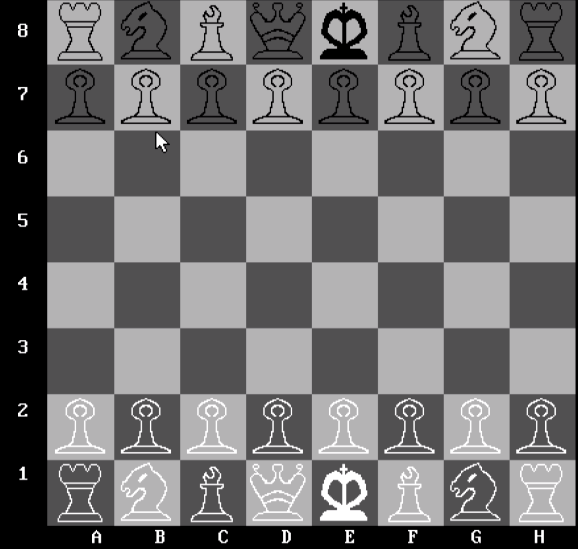

# TrazelChessAsm
Chess in asm was developed as a final project for school.
> [NOTE!]
> This project was developed at a time when I had limited experience with assembly language and computer science in general. Additionally, there were unusual constraints, such as the requirement for all code to be contained within a single file, which amounted to ten thousand lines of code, and to comply with a very specific assembly language version.
> As a result of these challenges, the code may not be optimal. However, it provides valuable learning opportunities and should be examined and approached with caution.

## installation:
1. clone the project
2. extract the `Tasm 1.4.zip` into the `c` directory
3. put the `chess.asm` file in the dir `C:\Tasm 1.4\Tasm`

## run:
1. run the programm `C:\Tasm 1.4\Tasm AutoMount Manual Edit-Tlink-TD.lnk`
2. `tasm chess.asm`
3. `tlink chess`
4. `chess.exe`

## example of how the chess looks
